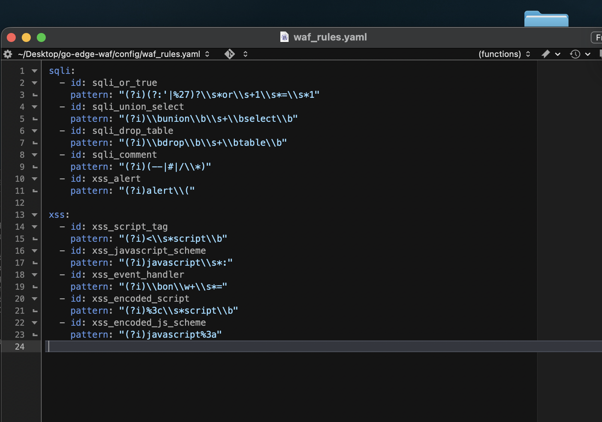
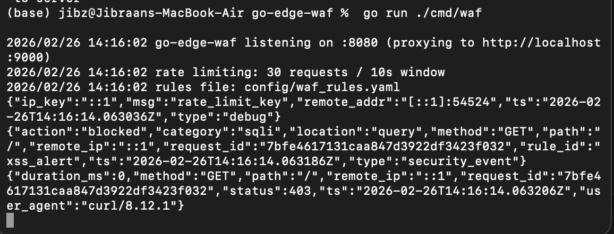
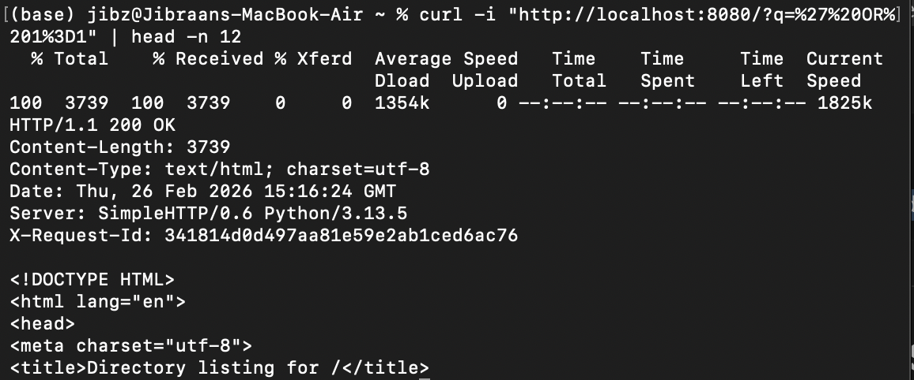
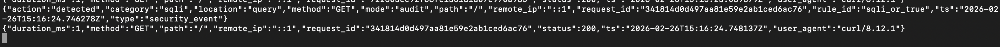

# go-edge-waf

A lightweight reverse proxy WAF written in Go.

## Run
Start a backend (example):
python3 -m http.server 9000

Run the proxy:
go run ./cmd/waf

Test:
curl -i http://localhost:8080

## Issue #1 – Reverse Proxy Implementation

### Proxy Running

### Request Flow + Logging

## Logging
Each request emits a single JSON log line (one event per request) and includes an `X-Request-Id` response header for traceability.
EOF

## Issue #2 – Structured JSON Logging

### Proxy Running

### JSON Log Output

## Issue #3 – SQL Injection Blocking

### Blocked Request (403)

### Security Event Log

## Issue #4 – XSS Blocking

### Blocked Request (403)

### Security Event Log

## Issue #5 – IP Rate Limiting

### Rate Limit Triggered (429)

### Security Event Log

### Config
Rate limiting can be configured via environment variables:
- `RATE_LIMIT_MAX` (default: 30)
- `RATE_LIMIT_WINDOW_SECONDS` (default: 10)

## Issue #6 – Configurable Rule Engine

WAF detection rules are externalized into `config/waf_rules.yaml` and compiled at startup.

### YAML Rule Configuration

### Config-Based Rule Blocking

If the YAML file is invalid or missing, the WAF falls back to safe default rules.

You can override the rules file path using:
- `WAF_RULES_PATH` (default: `config/waf_rules.yaml`)

## Issue #7 – Audit Mode (Log-Only Enforcement)

The WAF supports two operating modes:

- `block` (default): actively blocks malicious requests (403/429)
- `audit`: logs detections but allows traffic to pass

Mode can be configured via:
- `config/waf_rules.yaml` → `mode: block|audit`
- Environment variable override → `WAF_MODE`

### Audit Mode – Request Allowed
Even malicious input returns 200 OK when in audit mode:

### Audit Mode – Security Event Logged
Detections are still recorded as structured security events:

This enables safe monitoring before enabling blocking in production.
