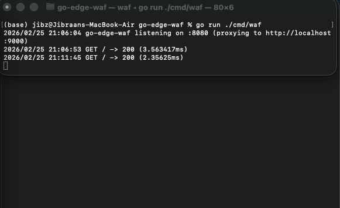
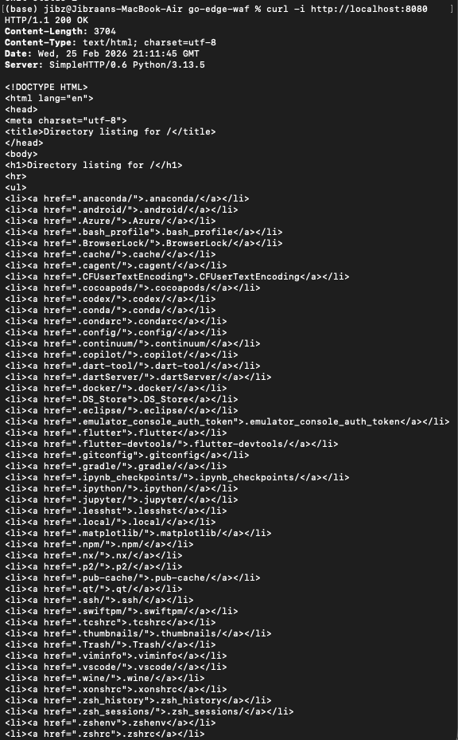
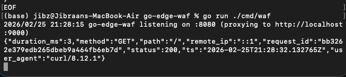
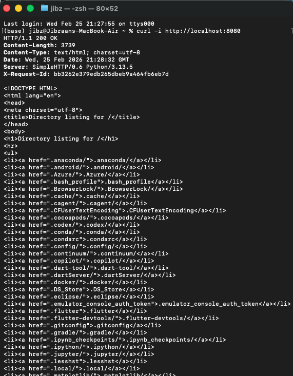
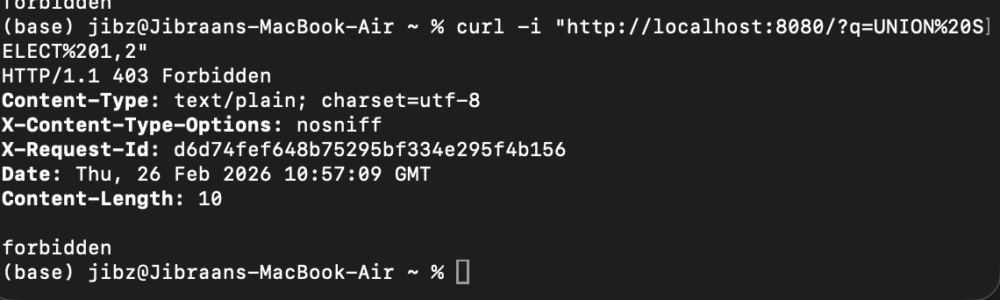
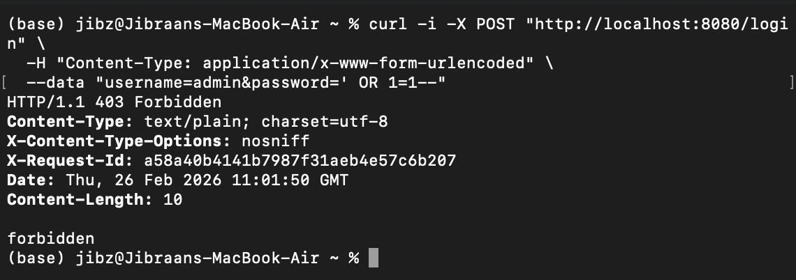
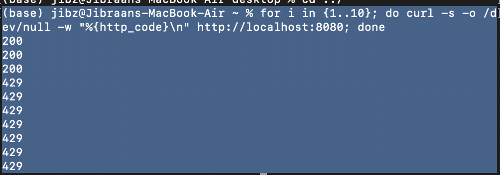
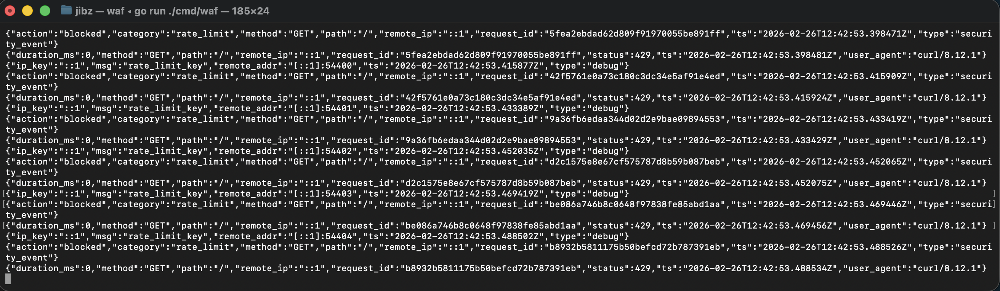

# go-edge-waf

A lightweight reverse proxy WAF written in Go.

## Run
Start a backend (example):
python3 -m http.server 9000

Run the proxy:
go run ./cmd/waf

Test:
curl -i http://localhost:8080

## Issue #1 – Reverse Proxy Implementation

### Proxy Running

### Request Flow + Logging

## Logging
Each request emits a single JSON log line (one event per request) and includes an `X-Request-Id` response header for traceability.
EOF

## Issue #2 – Structured JSON Logging

### Proxy Running

### JSON Log Output

## Issue #3 – SQL Injection Blocking

### Blocked Request (403)

### Security Event Log

## Issue #4 – XSS Blocking

### Blocked Request (403)

### Security Event Log

## Issue #5 – IP Rate Limiting

### Rate Limit Triggered (429)

### Security Event Log

### Config
Rate limiting can be configured via environment variables:
- `RATE_LIMIT_MAX` (default: 30)
- `RATE_LIMIT_WINDOW_SECONDS` (default: 10)
